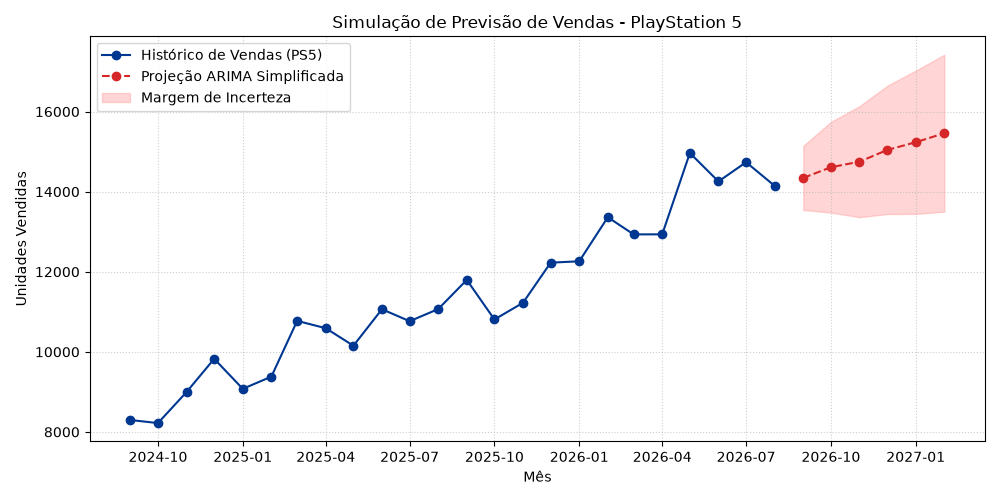
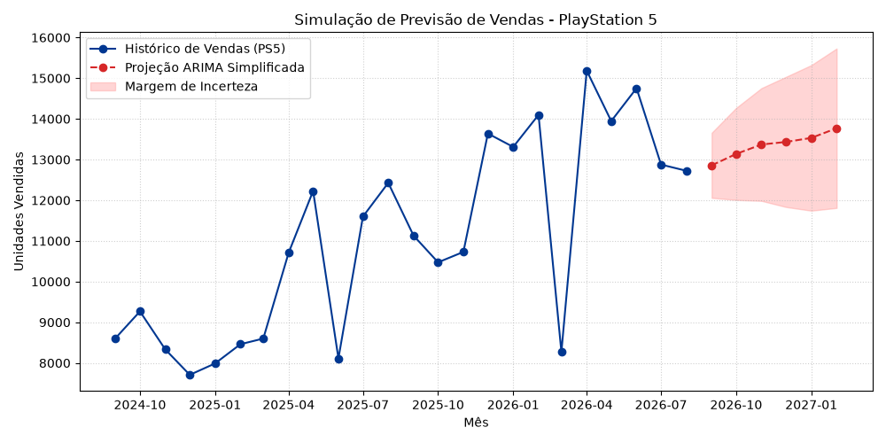
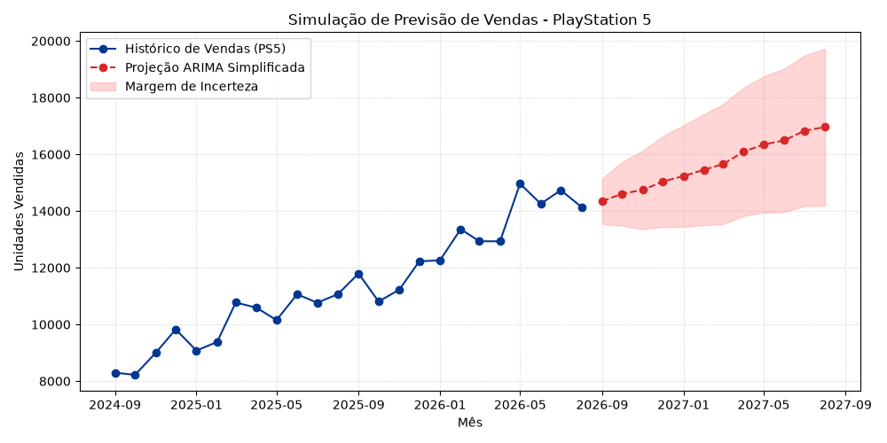
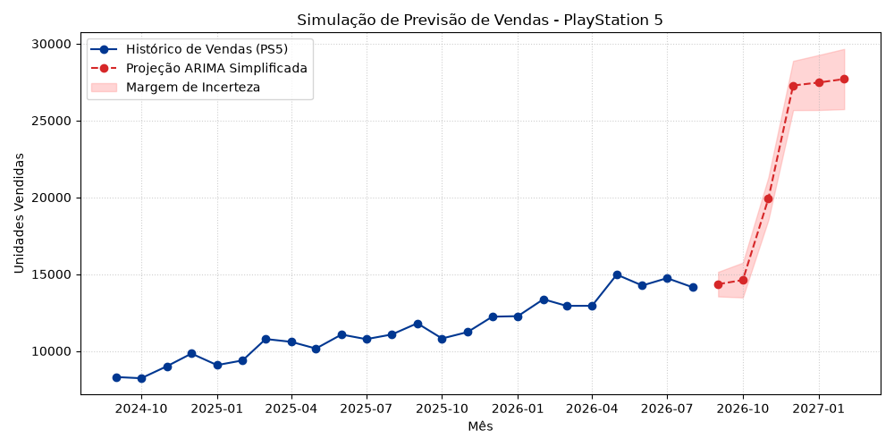
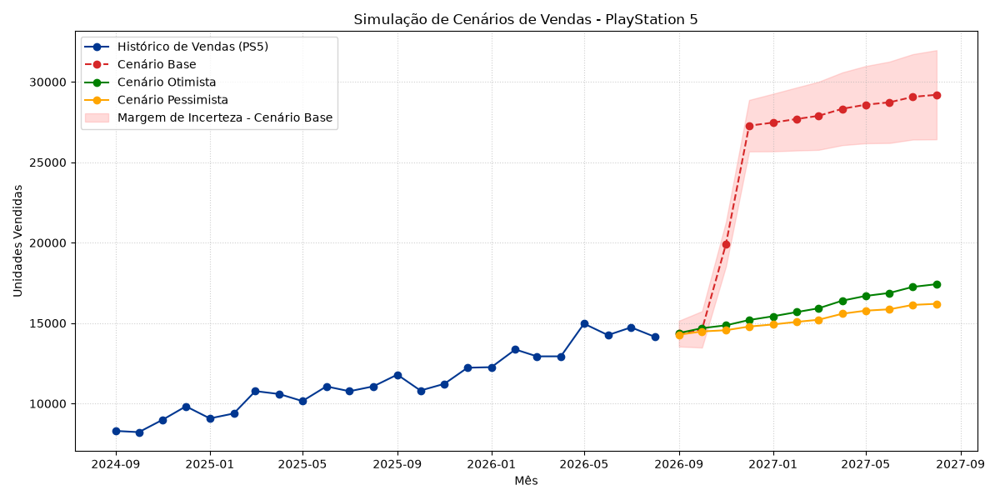

# 🎮 Time Series Analysis — PlayStation 5 Sales Forecasting

> **Business Intelligence project** focused on improving PlayStation 5 sales forecasting for Sony Interactive Entertainment, using statistical modeling with Python.

---

## 📋 About the Project

This project simulates a time series forecasting pipeline for PS5 unit sales, using concepts inspired by the **ARIMA model** (AutoRegressive Integrated Moving Average). Starting from a synthetic 24-month sales history, four progressive challenges are solved, each adding a new layer of complexity and realism to the forecast.

The project covers:

- Historical sales volatility analysis
- ARIMA-based forecast projection (simplified)
- Extended 12-month forecast horizon
- Black Friday and Christmas seasonality modeling
- Multi-scenario comparison dashboard (Base, Optimistic, Pessimistic)

---

## 📁 Project Structure

```
📦 Time-Series-Analysis-PlayStation-5-Sales-Forecasting-Statistical-Modeling-Python
├── 📂 Base/
│   └── vendasBase.py          # Base script — 6-month ARIMA forecast (seed 42, std 600)
├── 📂 ExitFigures/
│   ├── base.png               # Chart from base script
│   ├── challenge1.png         # Chart from Challenge 1
│   ├── challenge2.png         # Chart from Challenge 2
│   ├── challenge3.png         # Chart from Challenge 3
│   └── challenge4.png         # Chart from Challenge 4
├── challenge1.py              # Challenge 1 — Changing seed and volatility
├── challenge2.py              # Challenge 2 — Extended 12-month forecast
├── challenge3.py              # Challenge 3 — Seasonality (Black Friday & Christmas)
├── challenge4.py              # Challenge 4 — Multi-scenario dashboard
├── requirements.txt           # Python dependencies
└── README.md
```

---

## 🚀 Challenges

### 🔵 Base — `Base/vendasBase.py`
The foundation of the project. Generates 24 months of PS5 sales history using a linear growth trend (`8,000 → 15,000 units`) with random noise (`seed=42, std=600`). Applies simplified ARIMA logic to project the next **6 months**, displaying results in the terminal and generating a chart with an uncertainty band.

---

### 🟠 Challenge 1 — `challenge1.py`
**Goal:** Change the random seed to `465` and increase the noise standard deviation from `600` to `1,500`.

**Result:** The higher volatility increased unpredictability in the historical data. The average monthly growth dropped from approximately **254 to 179 units/month** (~29.6% reduction), directly impacting the projected values, which came out lower than those in the base model.

---

### 🟡 Challenge 2 — `challenge2.py`
**Goal:** Extend the forecast horizon from 6 to **12 months** (September 2026 – August 2027).

**Result:** The uncertainty band grows proportionally with the forecast horizon. In month 1, the margin of error is **±800 units**, and by month 12 it reaches approximately **±2,771 units**, demonstrating the compounding uncertainty over time.

| Month | Margin of Error |
|-------|----------------|
| 1     | ±800 units     |
| 6     | ±1,960 units   |
| 12    | ±2,771 units   |

---

### 🟢 Challenge 3 — `challenge3.py`
**Goal:** Add seasonality for **November** (Black Friday) and **December** (Christmas), applying a **+35% increase** to sales in those months.

**Result:** The seasonal boost is applied cumulatively: the increase applied in November elevates the base used in December's projection, which receives another 35% on top, resulting in a more accentuated combined effect between the two months.

---

### 🔴 Challenge 4 — `challenge4.py`
**Goal:** Build a **multi-scenario comparative dashboard** over 12 months, incorporating all previous challenges.

Three scenarios are simulated with the same random variation for fair comparison:

| Scenario       | Growth Rate                   | Seasonality  |
|----------------|-------------------------------|--------------|
| **Base**       | Historical average            | ✅ Yes (+35%) |
| **Optimistic** | Historical average × 1.15     | ❌ No         |
| **Pessimistic**| Historical average × 0.75     | ❌ No         |

> The uncertainty band is shown only for the Base scenario, making it easier to visualize the expected forecast variation over the projected horizon.

---

## 📊 Output Charts

| Script | Chart |
|--------|-------|
| Base |  |
| Challenge 1 |  |
| Challenge 2 |  |
| Challenge 3 |  |
| Challenge 4 |  |

---

## 🛠️ Technologies Used

| Tool | Purpose |
|------|---------|
| **Python 3** | Core language |
| **NumPy** | Numerical computation and random generation |
| **Pandas** | Data manipulation and time series structuring |
| **Matplotlib** | Data visualization and chart generation |

---

## ⚙️ How to Run

### 1. Clone the repository
```bash
git clone https://github.com/NyrxScar/Time-Series-Analysis-PlayStation-5-Sales-Forecasting-Statistical-Modeling-Python.git
cd Time-Series-Analysis-PlayStation-5-Sales-Forecasting-Statistical-Modeling-Python
```

### 2. Install dependencies
```bash
pip install -r requirements.txt
```

### 3. Run any script
```bash
# Base script
python Base/vendasBase.py

# Challenges
python challenge1.py
python challenge2.py
python challenge3.py
python challenge4.py
```

---

## 📌 Key Concepts

- **ARIMA (simplified):** The model simulates the differencing component (`d=1`) by computing the average month-over-month growth and using it as the trend for future projections.
- **Uncertainty Band:** Calculated as `800 × √i`, where `i` is the number of months ahead — reflecting increasing uncertainty over longer horizons.
- **Seasonality:** A multiplicative factor of `1.35` is applied to November and December to capture Black Friday and Christmas demand spikes.
- **Scenario Analysis:** Multiple growth assumptions allow stakeholders to evaluate best-case, expected, and worst-case outcomes side by side.

---

## 📄 License

This project is licensed under the [MIT License](LICENSE).
